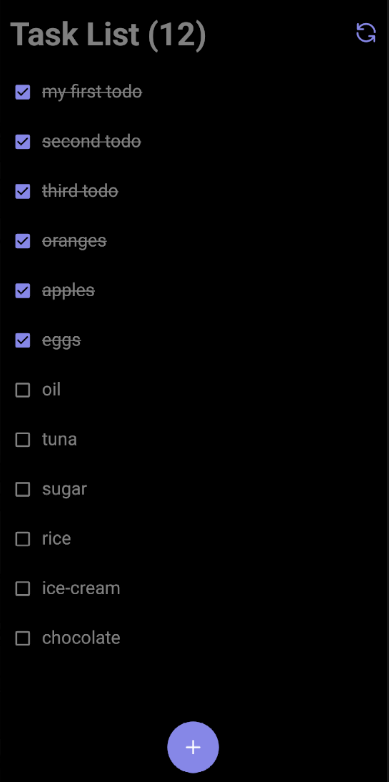

<p align='center'>
  
</p>

# Todo App
Simple todo list app which performs CRUD operations using RTK Query.

<p align='center'>
  
</p>

## Setup

### TodoList Server
[Complete Setup.](https://github.com/kaikcreator/todoListsServer.git)

After setting server, please truncate db.json as follows:
```json
{
  "lists": [],
  "todos": [
    {
      // New Schema
      "id": 1,
      "description": "my first todo",
      "isDone": true
    }
  ]
}
```
Now restart the server before moving forward.

### Client App
```bash
git clone https://github.com/hassanmahmood-dubizzlelabs/learning.git
cd learning
git checkout rtk-todo-v2 # LATEST
yarn
yarn start
a
```